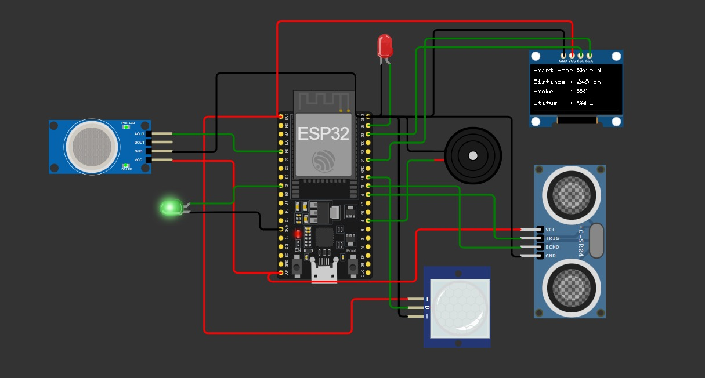
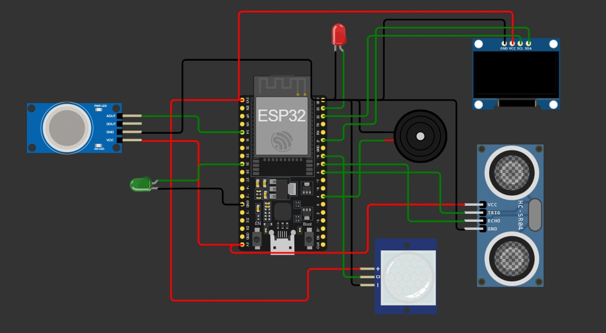

# 🏠 # 🛡️ Smart Home Shield
ESP32 Multi-Sensor Security & Safety Monitoring System

---

## 📌 Project Overview

Smart Home Shield is an ESP32-based embedded security and safety system designed to monitor home environments using multiple sensors.  
The system integrates motion detection, distance-based intrusion detection, and smoke/gas monitoring to provide real-time alerts via an OLED display, LEDs, and a buzzer.

This project demonstrates key embedded systems concepts including sensor interfacing, analog signal processing, event-driven programming, and priority-based decision logic.

---

## 🎯 Project Objectives

✔ Design a multi-sensor embedded monitoring system  
✔ Implement real-time hazard and intrusion detection  
✔ Apply priority-based alert handling logic  
✔ Provide live system feedback via OLED display  
✔ Simulate a practical smart home safety device  

---

## ⚙️ Working Principle

The ESP32 continuously reads inputs from connected sensors and evaluates predefined safety conditions:

- **MQ-2 Gas Sensor** → Measures smoke/gas levels (analog ADC value)  
- **Ultrasonic Sensor (HC-SR04)** → Calculates object distance using echo pulse timing  
- **PIR Sensor** → Detects motion based on infrared radiation changes  

The system processes sensor data and triggers alerts using a priority model:

1. 🔥 Smoke / Gas Hazard (Highest Priority)  
2. 🚨 Intrusion Detection (Distance Threshold)  
3. 🚶 Motion Detection  
4. ✅ Safe State (Default Condition)

Real-time system status is displayed on the OLED interface.

---

## 🧠 Condition-Based Results

| Condition | System Response |
|----------|------------------|
| Smoke Level ≥ Threshold | 🔥 SMOKE ALERT + Red LED + Beeping |
| Distance ≤ Threshold | 🚨 INTRUSION + Red LED + Continuous Alarm |
| Motion Detected | 🚶 MOTION + Red LED + Short Beep |
| All Conditions Safe | ✅ SAFE + Green LED |

---

## 📏 Detection Thresholds

### Distance Conditions (Ultrasonic Sensor)

- **Safe State:** Distance > 100 cm  
- **Intrusion Trigger:** Distance ≤ 100 cm  

### Smoke / Gas Conditions (MQ-2 Sensor)

- **Safe Environment:** Smoke Level < 1800 (ADC)  
- **Smoke Alert:** Smoke Level ≥ 1800 (ADC)  

> Note: Smoke thresholds are calibrated for Wokwi simulation ADC characteristics.

---

## 🛠 Hardware Components

- ESP32 DevKit (Microcontroller)
- PIR Motion Sensor
- HC-SR04 Ultrasonic Sensor
- MQ-2 Gas / Smoke Sensor
- SSD1306 OLED Display (I2C)
- Buzzer
- LEDs (Status Indicators)

---

## 🔌 Pin Configuration

| Component | ESP32 GPIO Pin |
|-----------|----------------|
| 🔴 Red LED | GPIO 23 |
| 🟢 Green LED | GPIO 25 |
| 🚨 Buzzer | GPIO 4 |
| 🚶 PIR Sensor (OUT) | GPIO 19 |
| 📏 Ultrasonic TRIG | GPIO 5 |
| 📏 Ultrasonic ECHO | GPIO 18 |
| 🔥 MQ-2 Analog Output | GPIO 34 |
| 🖥 OLED SDA | GPIO 21 |
| 🖥 OLED SCL | GPIO 22 |

---

## 🖥 OLED Display Interface

The OLED display provides real-time system feedback:

✔ Distance Measurement (cm)  
✔ Smoke / Gas Level (ADC Value)  
✔ Current System Status  

Example Output:

Distance : 250 cm & Smoke : 856

Status : SAFE

---

## ⚙️ Technologies & Concepts Used

- ESP32 (Arduino Framework)
- Embedded C / Arduino Programming
- Sensor Interfacing
- Analog to Digital Conversion (ADC)
- I2C Communication Protocol
- Event-Driven Programming
- Threshold-Based Detection Logic
- Priority-Based Alert System
- Human Machine Interface (OLED)

---

## 💻 Simulation Environment

This project is designed and tested using:

- Wokwi ESP32 Simulator
- Adafruit SSD1306 Library
- Adafruit GFX Library

---

## 📷 Circuit Diagram

---

## 📌 Applications

✔ Smart Home Security Systems  
✔ Hazard Detection Devices  
✔ Safety Monitoring Systems  
✔ IoT & Embedded Learning Projects  
✔ Academic Mini Projects  

---

## 🎯 Learning Outcomes

✔ Multi-sensor integration & interfacing  
✔ Real-time embedded decision logic  
✔ Sensor threshold calibration  
✔ Priority-based alert handling  
✔ Embedded user feedback design  
✔ Practical ESP32 programming concepts  

---

## ⭐ Future Improvements

- Wi-Fi Based Notifications
- Mobile App Integration
- Data Logging & Event History
- Security Arm / Disarm Mode
- Multi-level Threat Severity

---

## 👨‍💻 Author

Jay Sudani
B.E. Student | Embedded Systems Enthusiast
